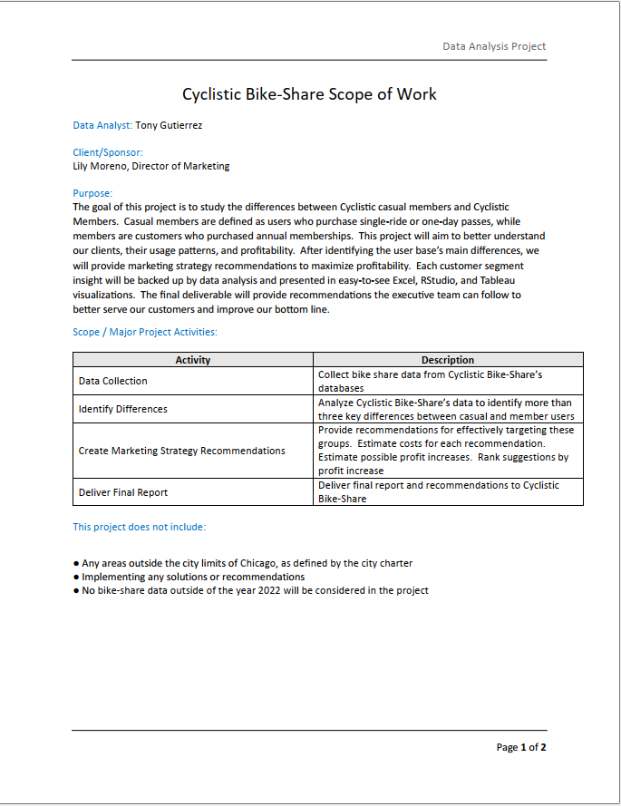
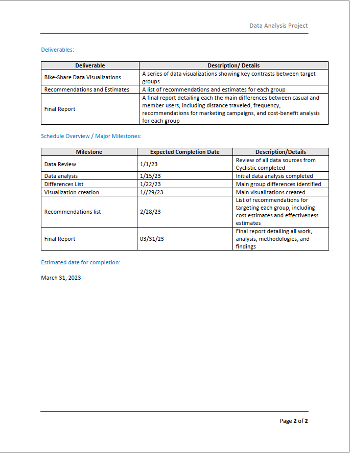

# Introduction

In this series of articles, we will discuss the Cyclistic Bike-Share Business Case from the Google Data Analytics Professional Certificate. 

Data analysis is a complicated process, so we must do our best to stay organized throughout the entire process.  That is why we will divide this Case Study into six main sections, based on the certificate program’s Data Analysis Roadmap:

1.  Ask
2.  Prepare
3.  Process
4.  Analyze
5.  Share
6.  Act

# Data Analysis Roadmap Step 1: Ask

The Ask Stage is where we hold deep discussions with all pertinent stakeholders to thoroughly understand our customers' needs.  We must ask effective questions, define the customers' main problem, use structured thinking to plan a solution, and effectively communicate with others to ensure project success. 

# Business Case Context

In this scenario, we are data analysts working with Cyclistic, a bike-share company in Chicago. We are tasked with studying our users so we can provide data-driven recommendations to our leadership team. 

In this section, we will go over the case’s main points. The first stage of the data analysis process is the Ask stage. From the initial discussions with the stakeholders, we need to define what the project will look like, what qualifies as a successful result, etc. You will find a summary of these discussions below.

Cyclistic Bike-Share is a fictitious company that offers 5824 bikes in 692 stations across Chicago to users for rent and use. There are two main users, casual riders, who purchase single-ride or full-day passes, and Cyclistic members, who purchase annual memberships.

The company’s finance analysist believe that annual memberships are much more profitable than casual rentals, so our marketing strategy should aim to maximize the number of annual members to consolidate future growth.

As data analysts on this company, our main task is to find out **how do annual members and casual riders use Cyclistic bikes differently**.

Our main deliverables include:

· A clear statement of the business task

· A description of all data sources used

· Documentation of any cleaning or manipulation of data

· A summary of your analysis

· Supporting visualizations and key findings

· Our top three recommendations based on your analysis

# Scope of Work

The last component of the Ask stage is to create a Scope of Work document. A good Scope of Work document is catered to the specific project and sets expectations and boundaries of an agreed upon outline of the work you’re going to perform on a project. You will find a copy of this document below:

# Conclusion

With a thorough Scope of Work document, we are ready to move to the second stage of the data analysis process: the Prepare Stage.

### Image Credits
Image Courtesy of: Oleksandr Canary Islands