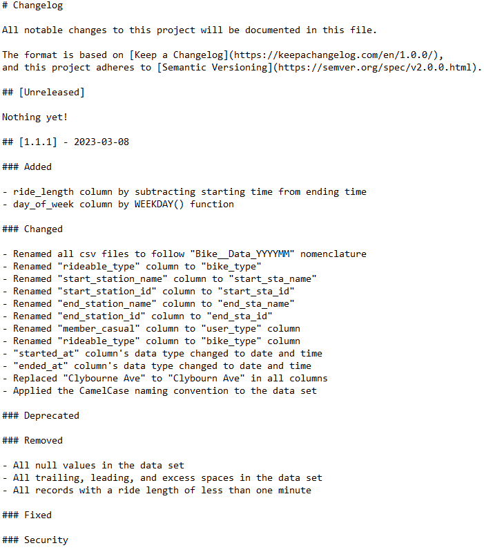

# Data Analysis Process Stage 3: Process

Now that we have prepared, organized, and protected our data, we can move on to the Process Stage of the Data Analysis process.  This stage is not only about cleaning the data.  We must also verify and report on the cleaning results.  This process of testing and transforming the data will help us maintain data integrity, thus ensuring that our results are valid. 

# Data Consolidation

The 2022 data is divided into monthly increments. This means that each spreadsheet represents a month’s worth of bike-sharing data. I decided to create a uniform naming convention for each file, which is Bike\_Data\_YYYYMM. This will ease our calling of the data in Excel, Tableau, and RStudio.

To begin the analysis, I opened a month’s worth of data in Microsoft Excel. Excel is a good tool to perform an initial analysis and interpretation of the data set. Because one month contains over 100,000 tuples, however, it is possible that the consolidated data set will have over 1 million records. Excel will struggle to perform an analysis on such a robust data set. This is because Excel is designed to handle small to medium-sized data sets. For the sake of following this case study’s rules, however, I continued to use Excel to manipulate the data.

After making sure that all sheets contained the same number of columns and the same labels, I combined all the 2022 monthly data sets into one by loading the entire interim data folder using the “Get Data From Folder” option in the Excel Data Tab. This will open the Power Query Editor, which will allow you to combine all 12 data sheets into one.

# Data Preprocessing

Now that the data is consolidated, we can begin the data preprocessing. I like to use the standard Google Data Cleanup Workflow. The 1st step is creating a copy of the data, so I unzipped the raw data files and loaded them into the interim data folder. The 2nd step is fixing the data table’s labels. I renamed all the labels that were inconsistent and ambiguous. One example of this is renaming the “rideable\_type” column, which identifies whether a bike is electric, regular, or docked, into “bike\_type” to make the label less obscure.

The 3rd step in the Data Cleanup Workflow, confirming missing data best practices, was difficult to complete. There were many nulls on the data set. In the real world, you would have a conversation with the client to clarify if this is a machine error during the data transfer, if this missing data can be recovered, or if this could be a dark data situation. Because this is a case study, however, I was forced to exclude all the null variables in the data set and only work with the completed data available. It is notable to say that some months had more missing data than others, so it would be interesting to contact the company to see what was the reason for this uneven distribution.

The 4th step is the clear formatting step, so I made sure the data set was organized in long format and compatible with database management systems, Tableau, RStudio, etc. The 5th step is confirming correct data types, so I looked at all the data types in each column to make sure that the spreadsheet correctly identified string, numeral, Boolean, and date types. The 6th step is the removing of duplicate records, so I used the standard “Group By” method in Power Query to find repeated records. The 7th step is removing irrelevant data, so I removed the ride_id column, which uniquely identified each ride. This column was removed because the data could potentially be used to identify customers. In the 8th step, I trimmed all trailing, leading, and excess spaces in the data cells.

The 9th step is to remove misspellings, so I performed a thorough search of the most commonly misspelled street names in the city. Finally, I made sure that all records in the dataset did not have inconsistent capitalization, incorrect punctuation, and other typos to complete the 12 stages of the Data Cleanup Workflow. The last task before analyzing the data is to record all these changes in the data changelog file.

# Conclusion

After completing our data changelog, we have completed the Process Stage.  This is a big deal because we have done all the hard work to ensure our analysis process is easy, and more important, we have ensured the insights we find are legitimate. Now we are ready for the next step in the data analysis roadmap: the Analyze Stage.