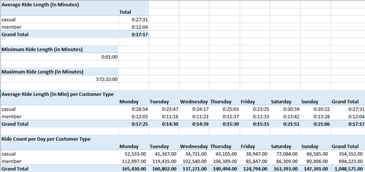

# Data Analysis Process Stage 4: Analyze

Now that we have uploaded, cleaned, and processed our data, we are ready to analyze and find key insights to help Cyclistic better understand their customers.  In the Analyze stage, we use tools to format and transform, sort, and filter the data to find patterns and draw conclusions.  We can make predictions and recommendation to help our stakeholders make data-informed decisions. 

# Power Query Editor 

With a validated and clean data set in hand, we are ready to start the data analysis stage. For the sake of following this case study’s rules, I continued to use Excel’s Power Query Editor tool to manipulate the data.

First, I added a column that contains the length of each ride, which was calculated by subtracting the ride’s start time from the end time. The ride_length column helped identify incoherent data records, such as trips with negative ride lengths, or canceled rides with a ride length of zero minutes. Without a client to discuss the best way to handle these records, I decided to filter them out of our analysis. Additionally, I created a column that states the day of the week the ride took place by using the Date.DayofWeek function. This was done to provide a deeper dimension to our analysis. This step concludes our work in the Power Query Editor.

# Building Pivot Tables

After connecting our clean data to a new spreadsheet, I created several pivot tables to conduct some prescriptive analysis and to get a better idea of what the data looks like. First, I created a pivot table that describes the average ride length for casual users, subscribed members, and overall users. The pivot table shows that casual users ride for longer periods of time than member users. Next, I created two pivot tables to show the minimum and maximum ride lengths in 2022. These pivot tables show that our shortest ride was one minute, while our longest ride was close to ten hours!

For the next two pivot tables, I added another layer of depth. First, I wanted to see how user types’ average ride lengths varied per day. Thus, I created a pivot table that shows user type on rows, day of the week on columns, and average ride length in each cell. Finally, I created a pivot table that explores the same dimensions as the previous pivot table, but this time, looks at the total number of rides in each cell. The picture below shows what these pivot tables look like.

# Conclusion

This concludes the use of Microsoft Excel as a data analysis tool. Although the process and analyze stages were successful, they were not as effective as possible. This is because more suitable tools like SQL and R were not used. In the next section, I will show how to complete the previous two phases using SQL in MySQL Workbench, DBeaver, and Visual Studio Code for SQL.

### Image Credits
Image Courtesy of: Wilfred Iven