# Data Analysis Process Stage 4: Analyze

Now that we have uploaded, cleaned, and processed our data, we are ready to analyze and find key insights to help Cyclistic better understand their customers.  In the Analyze stage, we use tools to format and transform, sort, and filter the data to find patterns and draw conclusions.  We can make predictions and recommendation to help our stakeholders make data-informed decisions.  

# Create a SQL Database

In this section, we will carry out the previous data pre-processing task and data analysis steps using a more practical tool called Structured Query Language, or SQL. First, it is important to note that we went back to the raw, unprocessed data. We will run a code script to load all 12 CSV files into one SQL table.

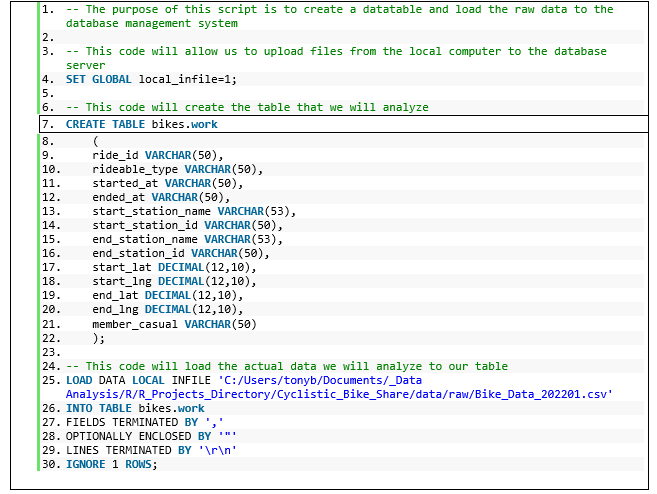

# Preprocess Data

We repeated lines 22 through 27 for the remaining CSV files to fill the table. Once the table contains all 2022 bike rental records, we ran the following script to tidy the data and prepare it for analysis.

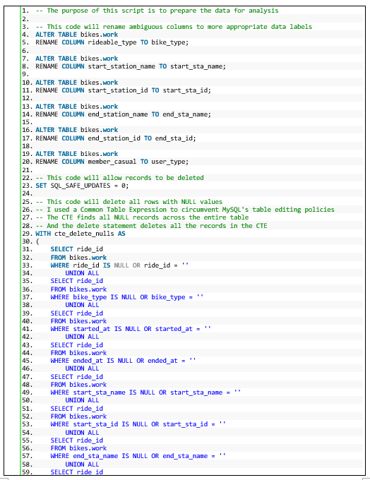

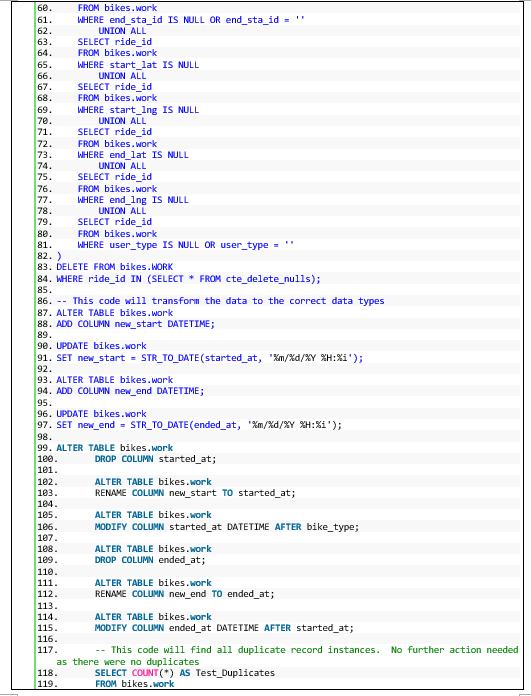

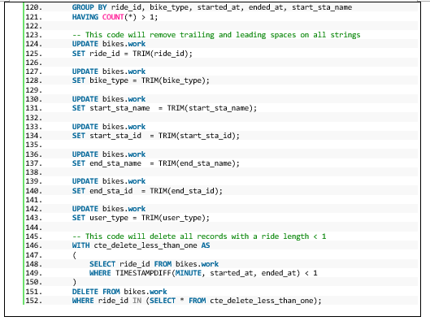

# Benefits of SQL

SQL is much more flexible than Excel, and we can easily hide irrelevant information. In Excel, we deleted the ride_id row because we wanted to protect our customers’ identity. With SQL, we can keep that data for query purposes and hide it from unauthorized users by creating a VIEW table. A view is a virtual table that is only stored in the memory and does not take up actual storage space. Let us further explore VIEWS.

SQL VIEWS allow us to keep the minimum number of columns in storage space to 13 to improve system performance. VIEWS can also help us protect the main database from accidents and can improve data literacy by giving more employees access to the data. The script below creates a VIEW that contains our base query query. The results are shown below.

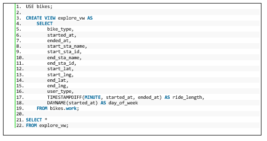

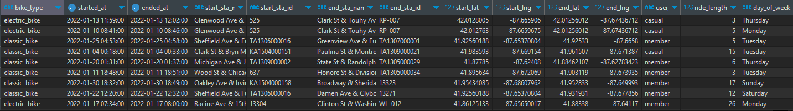

Just like when using Power Query Editor, the ride_length column helped identify incoherent data records, such as trips with negative or zero-minute ride lengths. Without a client to discuss the best way to handle these records, I decided to delete those rows from our analysis.

# Better Analysis with SQL Pivot Tables

After creating our base query, my next step was to recreate the previously built spreadsheet pivot tables using SQL. The first table we created found the average ride length in minutes of casual users, members, and both groups combined.

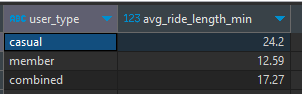

The second table we created found the shortest bike ride in our data set, while the third showed the longest.

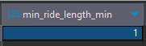

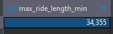

The fourth table we created found the average ride length for our three user groups and filtered them by the days of the week.

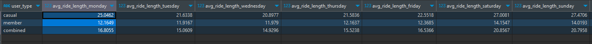

The fifth table we created found the number of rides for our three user groups and filtered them by the days of the week. The fourth and fifth tables help us find our user riding habits based on the day of the week.

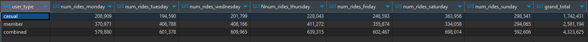

The sixth table we created counts the total number of users and divided their rides into three categories: short rides with a ride length of less than 10 minutes, medium rides with a ride length of between 10 and 20 minutes, and long rides of more than 20 minutes.

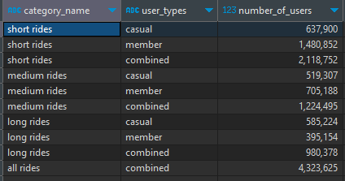

The seventh table we created found the number of rides for our three user groups and filtered them out by the month of the year.

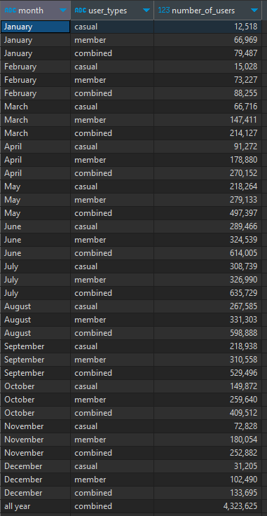

The eight table we created found the top 10 most common rides in Chicago that year.

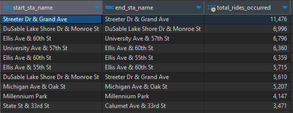

The last table we created found the number of rides for our three user groups and filtered them out by the hour of the day.

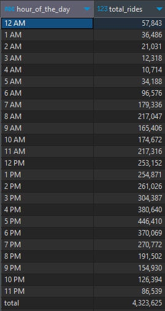

You can find a copy of the entire MySQL script on my [GitHub page](https://github.com/eangutierrez).

# Conclusion

These nine pivot tables are a good starting point for creating a SQL report that we can send to our stakeholders. Although SQL is a fantastic tool for calculating, sorting, and filtering our data, it lacks the ability to graphically interpret our data. The report we have created is good, but it is hard for people to make sense of data by only looking at tables. Luckily, we can perform our analysis in RStudio, which not only is a fantastic tool to calculate, sort, and filter data, but it also has many visualization capabilities to better understand our data. In the next section, I will show how to complete the previous two phases using RStudio and the R programming language.

### Image Credits
Image Courtesy of: Caspar Camille Rubin