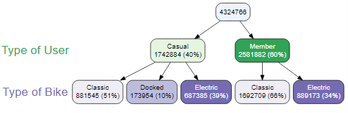
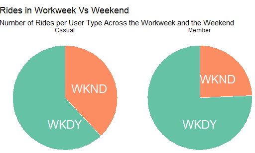

# Build RStudio Data Frame

In this section, we will carry out the previous data pre-processing and data analysis steps using a more practical tool called the R programming language. First, it is important to note that we went back to the raw, unprocessed data. We will run a code script to load all 12 CSV files into one R data frame.

# Preprocess Data in R

Once the data frame contains all 20222 bike rental records, we ran the following script to tidy the data and prepare it for analysis

# Benefits of R

R is much faster than SQL because it loads the data on RAM instead of a hard disk. That means that we can add a column for the day of the week the ride took place, and the ride duration in minutes without losing performance.

R is so powerful that we can easily recreate the previously built pivot tables using R code. Note that the numbers there is a tiny variation in the numbers depending on the tool that was used to analyze the data. This is because each tool has its own built logic when it approaches borderline cases. At this time, any data analyst would like to discuss these small discrepancies with the company’s data engineers and with the client to come up with a sensible solution. Because this is a capstone project and the client does not exist, we must take account of that phenomenon whenever it occurs in the real world. We will continue our analysis for now and further analyze the data.

# Data Visualizations in R

One of the most powerful aspects of R is that we can create powerful visualizations to convey useful facts about our data. It’s hard for people to understand the scale of our data, or discern key variables from looking at pivot tables. However, we can use that information to build striking visualizations that highlight what truly matters. For example, it can be intimidating to look at table seven, where we broke down the number of rides per user type per month. Which months have the highest number of rides? Are there seasons where the users choose other methods of transportation? And what type of users use the bikes more each month? Our pivot table has all of that information, but it is hard for management to find the answer. Let’s use that data to create a visualization that answers these questions.

# Number of Rides for 2022 per User Group

This is a powerful visualization because it easily shows answers to our questions. First, a big portion of our users rent bikes from May through October. This makes sense because we know that Chicago has wonderful climate on those months. Second, it seems that the usage rate of our bikes dramatically decreases on January, February, and December. It’s important to point out that our member users, in green, continue to ride at a higher rate than the casual users, in red. Third, the member users outperform the casual users throughout the entire year. The data shows that the member users rent the bikes more, so there is an incentive for Cyclistic to apply marketing strategies to convert casual users to member users, especially during peak riding season, to convert casual users to members and maximize profit.

# Ride Distribution Over Two Categories

Another powerful visualization is a variable tree that shows the data frame nested into subsets. Variable trees are useful to identify patterns in our data. Using the type of user on the first layer, our data is nested into two subsets: the casual user and the member user. This layer shows that 60% of our users are subscribers, and 40% of the users are casual users. Adding the type of bike as a second layer creates additional subsets. Of the member users, 66% use classic bikes, and 34% use electric bikes. Additionally, of the casual users, 51 % use classic bikes, 39% use electric bikes, and 10% use docked bikes. As we are dealing with a business case, we cannot raise concerns to our client, but in the real world, we should discuss with our clients whether the docked bike type should be changed to another type of bike, or whether it should be filtered from our analysis.

We can draw two conclusions from this visualization:

· Member users do not use docked bikes.

· Both casual and member users prefer classic bikes.

# Distribution of Rides per Minute

We can also build a histogram to look at the frequency distribution of bike rides per ride length:

We can draw two conclusions from this visualization:

· The vast majority of the rides have a ride length of less than 10 minutes.

· Rides longer than ~ 25 minutes have a frequency of less than 50 K rides.

Because the majority of rides have a ride length of less than 10 minutes, it could mean that the bikes are rented with a specific objective in mind, such as commuting to work, or getting groceries, instead of riding for leisure.

# Number of Rides per Day of the Week

We can also build a bar graph that divides the rides per day of the week to find additional user preferences:

We can draw two conclusions from this visualization:

· Member users use bikes throughout the entire week, but there is a decrease in use on weekends.

· On weekends, casual users ride more. There are about + 100 K bike rides on Saturday, and about + 50 K more rides on Sunday.

Because there is an increase of casual users on weekends, Cyclistic Bike-Share could capitalize by running marketing promotions to target user conversion and promote user growth.

# Number of Rides per Hour of the Day

We can also build a heat map that looks at the day of the week and the hour of the day to find the times our users prefer to ride bikes:

We can draw several conclusions from this visualization:

· From Tuesday through Friday, the most popular use of bikes is for commutes from 6:00 am to 8:00 am, and from 4:00 pm to 6:00 pm.

· On Saturday, the most popular use of bikes is from the hours of 7:00 am to 8:00 am, and from 3:00 pm to 6:00 pm.

· On Sunday, the most popular use of bikes is from the hours of 9:00 am to 6:00 pm.

Knowing the most popular times of use is very useful for the marketing team. Cyclistic Bike-Share could capitalize by running marketing promotions to offer discounts in non-popular hours to promote bike usage, or increase the prices during popular hours if bike demand overtakes supply.

# Build Pie Charts if Requested

We can also build visualizations that compare usage among groups of users. Although there are better ways to visualize this information, some clients may prefer pie charts, and the team built this to be prepared in this case:

We can draw two conclusions from this visualization:

· Both casual and member users rent bikes mainly on weekdays.

· Casual users use bikes on weekends at a higher rate than member users.

# Build Maps Showing Popular Routes

Finally, we can create a visualization of a map that contains the most popular routes by both member and casual users:

We can draw several conclusions from these visualization:

· Member users are more spread throughout the area.

· Many casual riders start from the Chicago Harbor.

· It seems that member users have shorter trips than casual users. This lines up with our previous assessment that casual users ride for leisure, while member users ride with a purpose.

Cyclistic Bike-Share can take advantage of this opportunity by placing ads to promote user conversion near the Chicago Harbor area, while also assessing proper inventory levels to keep up with demand.

You can find a copy of the entire R script on my [GitHub page](https://github.com/eangutierrez).

# Conclusion

These visualizations are a good starting point for creating a stakeholder presentation. Although R is an excellent data analysis and visualization tool, there are several organizations that choose to use other programming languages to analyze and visualize data. In the next section, I will show how to complete the previous two phases using Python and Jupyter Lab.