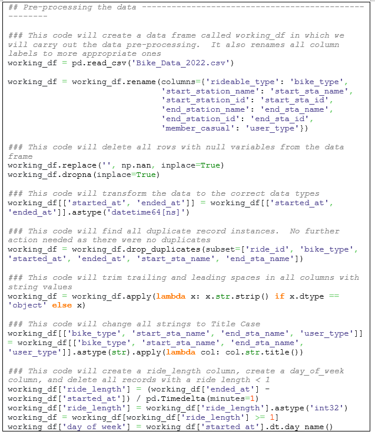
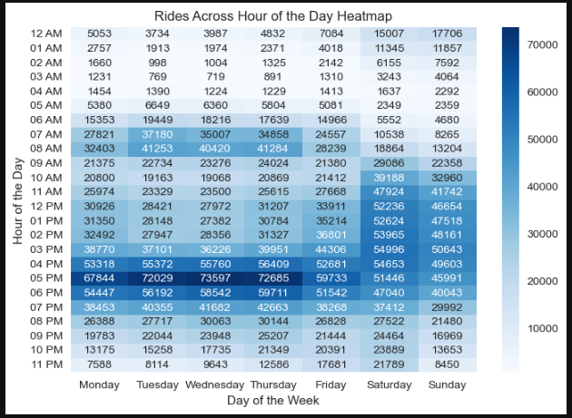

# Creating Python DataFrame

In this section, we will carry out the previous data pre-processing and data analysis steps using a more popular language called Python. First, it is important to note that we went back to the raw, unprocessed data. We will run a code script to load all 12 CSV files into one data frame.

# Preprocessing Data in Python

Once the data frame contains all bike rental records, we ran the following script to tidy the data and prepare it for analysis

# Benefits of Python

Although R is much faster than Python because it loads the data on RAM instead of a hard disk, it also brings a few drawbacks. Because RAM is being used, data analysts must be mindful of how much memory is being used, as RAM is much scarcer than hard disk memory. With large datasets such as the one we are working on, we must account for all the variables we store in memory, all the different copies of the dataset as we pre-process the data, and the number of records being passed to a graphic visualization function.

Memory usage in Python is much less of a concern. This is because it uses virtual memory from the computer’s operating system. This gives data analysts a lot of flexibility:

· With proper nomenclature, data analysts can assign variable names to the dataset during each of the data pre-processing steps

· At its core, Python is a general-purpose, object-oriented programming language that emphasizes code readability

· This means that complex tasks, such as creating robust data visualizations, can be broken down into small, simple steps. This is vital when working in teams and reading another person’s work

# Python's Strenghts

Because of the reasons stated above, Python is one of the most popular programming languages today. Python users are not confined to just performing data analytics tasks. They can create computer programs, build and maintain data pipelines, and many other tasks. Many companies are partial to this flexibility, which is why good analysts must be able to write both R and Python code. The great news is that R provides a strong foundation to quickly transition to Python.

The code below demonstrates how Python can effortlessly produce the same pivot tables we built in Excel, SQL, and R.

# Motivation to Learn Python

Each programming language has its own strengths and weaknesses. Naturally, there are some tasks that are much more difficult to complete in some languages than others. One of the main examples encountered during this business case is the R Vtree library. Python does not have an easy way to create a variable tree. Luckily, one of Python’s strengths is creating interactive visualizations using the Plotly library. You can see an example of an interactive graph called a Sankey Chart, which shows the distribution of all the records via through the user type and bicycle type categories.

Python’s standard plotting library is called Matplotlib, and through it we can easily produce insightful visualizations, just like with R’s ggplot2 package.

Python is constantly improving because of dedicated research teams who build and improve current libraries. For example, Seaborn uses Matplotlib as a base and builds an even higher-level interface to easily plot complicated graphs, such as heat maps.

Because more people are familiar with Python, it can be much easier to adapt techniques from other computer languages to Python. For example, the Folium library helps brings the incredible versatility of JavaScript’s leaflet.js library to plot interactive maps similar to those found on Tableau.

You can find a copy of the entire Python script on my [GitHub page](https://github.com/eangutierrez).

# Conclusion

As you can see, Python is a powerful tool that every data analyst should understand. In the real world, there are complex problems that are better approached with a particular language, or with a specific data library or package. The more tools at your disposal, the better. Although Python is good at creating visualizations, we can use data visualization tools like Tableau to create the most professional visualizations and tell a story through our data. In the next section, I will show how to create top-level visualizations in Tableau.