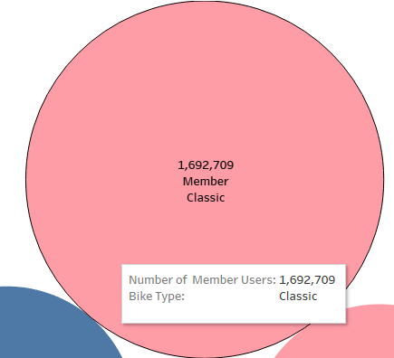
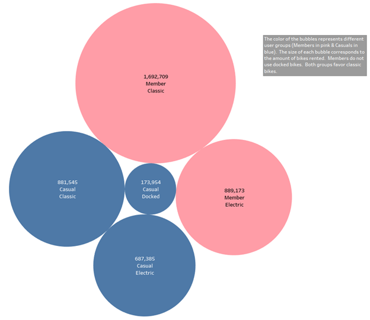
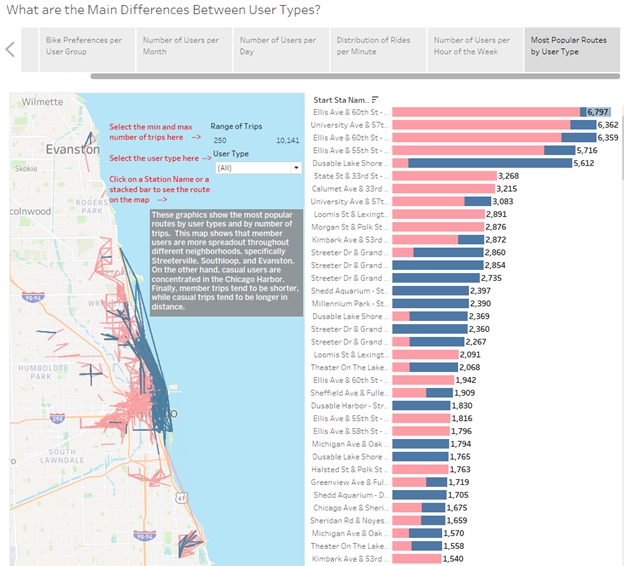
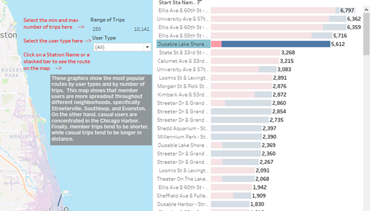
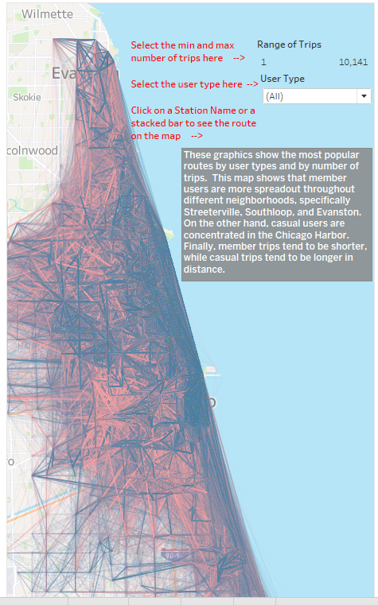

# Data Analysis Process Stage 5: Share

Now that the Analysis is complete, we must bring the data to life.  It was hard to understand the data just by looking at pivot tables.  This is why we used R and Python to create data visualizations that tell a story through the data.  But showing cool visualizations to our stakeholders is not enough.  We must bring context and communicate to help them understand the results of our analysis.  

This is what The Data Analysis Process' Share Stage is all about. We must organize our visualizations into a coherent presentation, explain what each of these visualizations mean, and provide data-driven recommendations to help our stakeholders understand the differences between casual users and member users.  

# Tableau's Strenghts

Tableau is a professional tool used to create graphics and other professional visualizations to tell a story through data. Additionally, we can combine Tableau visualizations to create dashboards that easily convey complex ideas. These dashboards can be interactive to let the users change data filters or parameters to look at the data from multiple points of view. Finally, you can combine several dashboards to create story boards that answer questions by deep diving into the data.

Let’s take a look at one of the visualizations (or Tableau Sheets) we created to show Tableau’s capabilities. Tableau’s version of the variable tree chart is the bubble chart. By adding the number of users as a measure and the user and bike types as dimensions, Tableau created the following graph:

To people that lack the business case’s context, this may be difficult to interpret. Thankfully, we can use Tableau’s Tooltip to provide additional information. The Tooltip is activated every time we hover our mouse on a specific object:

Hovering over the biggest bubble told us that this bubble represents the number of member users, the amount of member users, and the bike type. Here we also color-coded each bubble to represent casual users (in blue) and member users (in pink).  Finally, the size of each bubble shows the number of records associated with each bike type.  This is a strong visualization because we have incorporated multiple elements, size, color, and interactivity, to help users understand.  

This additional context can be crucial to tactile learners. On a storyboard, we can even create a textbox that provides additional information to help anyone who uses our files:

# The Power of Tableau Dashboards

With Tableau, we can use color, shape, size, and other elements to create powerful visualizations such as this:

This is a Tableau dashboard.  Dashboards are combinations of data visualizations that are combined to convey a complex idea.  For example, this dashboard combines two visualizations: a map that shows a map that displays the most popular routes, and a horizontal stacked bar graph that shows the most popular routes and the number of times that route was taken. We can do several things with this dashboard. First, we can click on a specific route’s name or bar graph to display it on the map:

We can also provide filters to maximize or minimize the number of routes. We can seven provide additional context and instructions to help any user who may be intimidated by technology. This is a visualization without using a minimum or maximum number of times a route was used:

You can find a copy of the entire Tableau Story on my [Tableau Public](https://public.tableau.com/app/profile/tony.gutierrez).

# Conclusion

With a completed storyboard, we are ready to deliver a thorough presentation to our client. After completing our data visualizations in Tableau, we are ready to move to the last stage of the data analysis process: the Act stage. In the next section, we will share our completed storyboard along with a set of recommendations with the Cyclistic Bike-Share leadership.